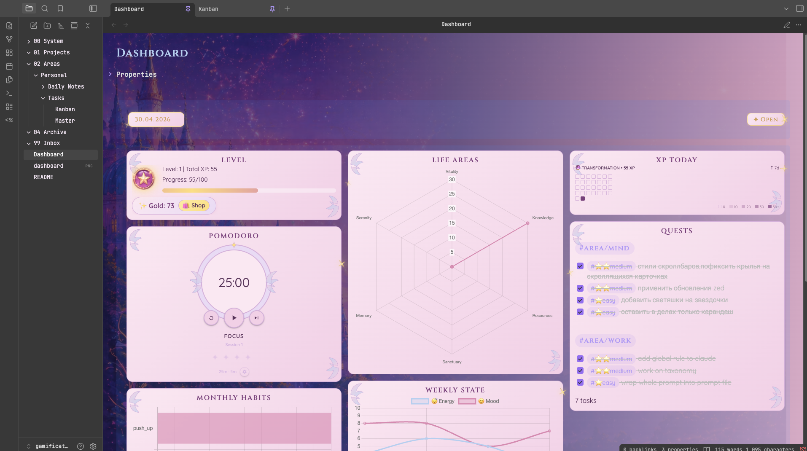

# ✨ Winx Vault — Obsidian RPG Dashboard

A gamified personal productivity system built in Obsidian with a magical-girl aesthetic. Track tasks, habits, energy, and life balance through an RPG-style dashboard.



---

## 🗂 Vault Structure

```
📁 Daily Notes/       — Daily journal entries (mood, energy, habits, XP log)
📁 Tasks/
   ├── Master.md      — All tasks inbox (new tasks prepend here)
   └── Kanban.md      — Kanban board view of tasks
📁 Settings/
   ├── Templates/
   │   └── Daily Note.md          — Templater template for new daily notes
   ├── scripts/dvWidgets/         — Dataview JS widgets powering the dashboard
   │   ├── config.js              — Central config (areas, difficulties, XP values, levels)
   │   ├── levelToday.js          — Level & XP progress card
   │   ├── xpToday.js             — XP earned today + streak heatmap
   │   ├── habits.js              — Monthly habits bar chart
   │   ├── lifeAreas.js           — Radar chart of life area scores
   │   ├── weeklyState.js         — Energy & mood line chart
   │   ├── pomodoro.js            — Pomodoro timer
   │   └── dailyNote.js           — Date selector widget
   └── scripts/QuickAdd/
       └── NewTask.js             — QuickAdd macro for creating tagged tasks
📄 Dashboard.md       — Main dashboard (all widgets composed here)
```

---

## ⚙️ Required Plugins

> Obsidian version: 1.12.7

| Plugin | Version | Purpose |
|---|---|---|
| **Dataview** | 0.5.68 | Powers all JS widgets |
| **Templater** | 2.19.3 | Daily note template |
| **Tasks** | 7.23.1 | Task tracking & completion dates |
| **QuickAdd** | 2.12.0 | `NewTask` macro for fast task creation |
| **Charts** | 3.9.0 | Radar, bar & line charts in widgets |
| **Meta Bind** | 1.4.8 | `INPUT[slider]` and `INPUT[date]` inline inputs |

---

## 🎮 XP & Leveling System

Tasks are tagged with a **difficulty** and a **life area**. Completing a task awards XP.

### Difficulties

| Tag | XP |
|---|---|
| `#⭐easy` | 5 XP |
| `#⭐⭐medium` | 10 XP |
| `#⭐⭐⭐hard` | 20 XP |
| `#⭐⭐⭐⭐epic` | 50 XP |

### Level Formula

Level `n` costs `100 + (n-1) × 25` XP. Levels are named:

| Name | Total XP threshold |
|---|---|
| VOID | 0 |
| SPARK | 10 |
| GLOW | 20 |
| AURA | 30 |
| TRANSFORMATION | ∞ |

### Habit Bonus

Complete a habit **30+ times** in a month → **+100 XP** bonus per qualifying habit.

---

## 🌐 Life Areas (Radar Chart)

| Emoji | Tag | Radar Name |
|---|---|---|
| 🏃 Body | `#area/body` | Vitality |
| 💼 Work | `#area/work` | Craft |
| 🧠 Mind | `#area/mind` | Knowledge |
| 💰 Wealth | `#area/wealth` | Resources |
| 🏡 Base | `#area/base` | Sanctuary |
| 🌄 Occasions | `#area/occasions` | Memory |
| 🌙 Rest | `#area/rest` | Serenity |

---

## 📝 Daily Note

Each daily note tracks:
- **Energy** & **Mood** (1–10 sliders)
- **XP Log** — freeform notes on what you did/learned
- **Habits** — checkbox tasks tagged `#habit/<area>/<name>`

Create via Templater from `Settings/Templates/Daily Note.md`.

---

## ✅ Creating a Task

Use the **QuickAdd `NewTask` macro**:
1. Choose difficulty (Easy / Medium / Hard / Epic)
2. Choose life area
3. Fill in task details in the Tasks modal
4. Task is prepended to `Tasks/Master.md`

---

## 🖥 Dashboard Widgets

| Widget | Description |
|---|---|
| **Level** | Current level, total XP, progress to next level |
| **Pomodoro** | 25/5 min focus timer, session counter |
| **Monthly Habits** | Bar chart of habit completions this month |
| **Life Areas** | Radar chart — XP earned per area this month |
| **Weekly State** | Line chart of energy & mood over the past week |
| **XP Today** | XP earned today, current level name, streak heatmap |
| **Tasks** | Tasks due today, grouped by life area tag |
